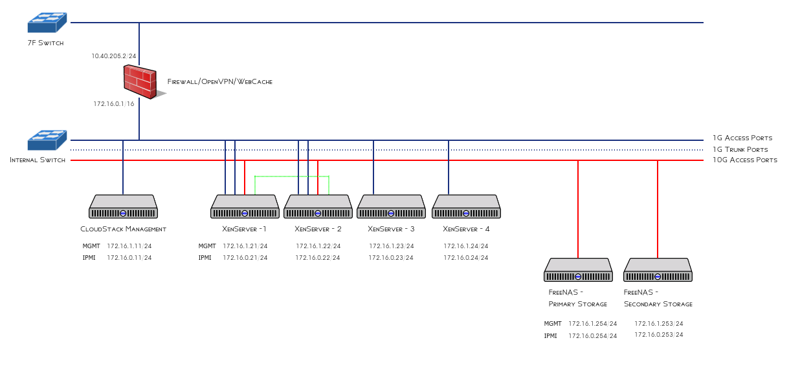

# CloudStack 4.10 with XenServer 7.0 Installation

## Physical Network Structure


## System Specification

| IP| 	CloudStack Type|	OS|	Note|
| --- | :--------------------: | ------ |--------: |
|172.16.1.11/16 (em1:internal) 10.40.205.11/24 (em2:public) | Management | CentOS 7 | Management Server |
| 172.16.1.21/16 | XenServer Host | XenServer 7.0 | Hypervisor |
| 172.16.1.22/16 | XenServer Host | XenServer 7.0 | Hypervisor |
| 172.16.1.254/16 |Primary Storage | FreeNAS 11	| NFS |
| 172.16.1.253/16 | Secondary Storage | FreeNAS 11 | NFS |

## Storage Settings
TODO

## Management Server Installation
| Category | Setting  value |
| :------------: | :---------------------------------: |
| Hostname | cstack-mgmt.localdomain |
| Timezone | Asia/Seoul |
| root password | !@******(Default Password)|
| Partitioning Layout |
| Installation Type | Basic Server |
|IP| 10.40.205.191 |
|Netmask |255.255.255.0 |
|Gateway | 10.40.205.1 |

### Basic settings
```
# hostnamectl set-hostname cstack-mgmt.localdomain
# systemctl restart systemd-hostnamed.service
# echo "172.16.0.11 $(hostnamectl status --static)" >> /etc/hosts
```

### Enabling EPEL repository 
```
yum install -y epel-release
```

### CloudStack repository settings
Edit or add a file, /etc/yum.repos.d/cloudstack.repo
```
[cloudstack]
name=cloudstack
baseurl=http://cloudstack.apt-get.eu/rhel/7/4.10/
enabled=1
gpgcheck=0
```

### Partitioning
I used secondary partition for serving /var/lib contents
```
# parted /dev/sdb mkpart primary 1 100%
# mkfs -t xfs -L DATA /dev/sdb1
# echo "/dev/sdb1        /var/lib            xfs    defaults    0 0" >> /etc/fstab
# mount /dev/sdb1 /mnt 
# rsync -av /var/lib/* /mnt/
# umount /mnt
# mount /var/lib
# restorecon -R /var/lib
```

### Time Server
```
yum install chrony -y
sed -i 's/^#allow 192.168\/16/allow 172.16.0\/24/' /etc/chrony.conf
systemctl enable chronyd | systemctl start $_
```

### MariaDB DBMS Settings

#### Installing MariaDB
```
# yum install -y mariadb-server
```
```
# mv /etc/my.cnf{,.back}
# cat <<EOF > /etc/my.cnf
[mysqld]
datadir=/var/lib/mysql
socket=/var/lib/mysql/mysql.sock
# Disabling symbolic-links is recommended to prevent assorted security risks
symbolic-links=0
# Settings user and group are ignored when systemd is used.
# If you need to run mysqld under a different user or group,
# customize your systemd unit file for mariadb according to the
# instructions in http://fedoraproject.org/wiki/Systemd
innodb_rollback_on_timeout=1
innodb_lock_wait_timeout=600
max_connections=350
log-bin=mysql-bin
binlog-format = 'ROW'

[mysqld_safe]
log-error=/var/log/mariadb/mariadb.log
pid-file=/var/run/mariadb/mariadb.pid

#
# include all files from the config directory
#
!includedir /etc/my.cnf.d
EOF
```
#### Daemon start
``` 
# systemctl enable mariadb.service && systemctl start $_
```
#### Set root password
```
# /usr/bin/mysqladmin -u root password '3EnzhLKtuH'
```

> Note that *you must change the password of the root user*

### Install CloudStack management packages 
```
yum -y install cloudstack-management
Install utility file for XenServer
wget http://download.cloud.com.s3.amazonaws.com/tools/vhd-util -O /usr/share/cloudstack-common/scripts/vm/hypervisor/xenserver/vhd-util
```

### SELinux
CloudStack can be blocked by security mechanisms, such as SELinux. Disable SELinux to ensure + that the Agent has all the required permissions.
```
sed -i s/SELINUX=enforcing/SELINUX=permissive/g /etc/selinux/config
setenforce 0
```
### Initialize CloudStack database
```
cloudstack-setup-databases cloud:gKtEe8kWX@localhost --deploy-as=root:3EnzhLKtuH --mshost=172.16.1.11
```

If you have multiple NICs installed on your system, please set the management IP address with the mshost parameter.


> *You must change the password of the cloud user.*

### Firewall

**NOT FULLY TESTED IT**

It requires checking if it works or not

#### Setting Zone with interfaces
As you can see all interfaces are allocated to the zone public.

```
# firewall-cmd --get-active-zone
public
  interfaces: em1 em2
```
I created an internal zone with some interfaces, in this case, em2 and enp0s26f7u1.
```
# firewall-cmd --zone=internal --change-interface=em1
success
# firewall-cmd --get-active-zone
internal
  interfaces: em1
public
  interfaces: em2
``` 

#### Check Services for each zone
```
# firewall-cmd --zone=public --list-services
dhcpv6-client ssh
# firewall-cmd --zone=public --remove-service=ssh --permanent
success
# firewall-cmd --zone=public --remove-service=dhcpv6-client --permanent
success
# firewall-cmd --zone=public --list-services
success
# firewall-cmd --zone=internal --list-services
dhcpv6-client ipp-client mdns samba-client ssh
```

#### Enable HTTP traffic in the public zone for accessing CloudStack management console
by default, CloudStack management console uses 8080/tcp. so added 8080/tcp in the public zone as below:

The Management Servers communicate with each other to coordinate tasks.
This communication uses TCP on ports 8250 and 9090.
The console proxy VMs connect to all hosts in the zone over the management traffic network. 
Therefore the management traffic network of any given pod in the zone must have connectivity to the management traffic network of all other pods in the zone.
The secondary storage VMs and console proxy VMs connect to the Management Server on port 8250. If you are using multiple Management Servers, the load balanced IP address of the Management Servers on port 8250 must be reachable.

```
# firewall-cmd --zone=public --add-port=6443/tcp --permanent
success
# firewall-cmd --zone=public --list-port
6443/tcp
```

#### Enable un-secure traffic from SystemVM to Management
```
# firewall-cmd --zone=internal --add-port=8080/tcp --permanent
success
# firewall-cmd --zone=internal --add-port=8250/tcp --permanent
success
# firewall-cmd --zone=internal --add-port=9090/tcp --permanent
success
# firewall-cmd --zone=internal --list-ports
8250/tcp 8080/tcp 9090/tcp
```

### Setup management
#### Increase session timeout
You need to open the file, **/etc/cloudstack/management/web.xml** and change the value as below. in this case, I set the 60 min as a session timeout.
```
    <session-config>
        <session-timeout>60</session-timeout>
    </session-config>
```

### Set up the CloudStack management
```
cloudstack-setup-management --tomcat7 --no-start --https
```

### Prepare NFS Shares
We created an NFS export on the FreeNAS secondary storage and mounted it as below:
```
mkdir -p /mnt/secondary
mount -t nfs -o vers=4 172.16.1.253:/mnt/tank/cs-secondary-vol01 /mnt/secondary/
```
### Setup system VM template
CloudStack uses a number of system VMs to provide functionality for accessing the console of virtual machines, providing various networking services, and managing various aspects of storage.

This step will acquire those system images ready for deployment when we bootstrap your cloud.
```
/usr/share/cloudstack-common/scripts/storage/secondary/cloud-install-sys-tmplt \
-m /mnt/secondary \
-u http://packages.shapeblue.com/systemvmtemplate/4.10/systemvm64template-4.10-xen.vhd.bz2 \
-h xenserver \
-F
```

### Clean up
```
umount /mnt/secondary
rmdir /mnt/secondary
Start CloudStack management service
systemctl start cloudstack-management
```

### Checking
> https://<IP>:6443/client

## XenServer setting
Applying XenServer Patch
NOT INTENT TO WRITE DOWN

Physical networking setup
I chose to use network interfaces as below scheme

You can get each network UUID via this command
```
xe pif-list
xe pif-list device=eth<Num>
```

### Network configurations
* Interface: eth5 / NIC 5
* Bandwidth: 10Gb
```
nic=eth5
network_uuid=$(xe pif-list device=$nic | grep network-uuid | awk '{print $4}')
xe network-param-set name-label=cloud_management uuid=$network_uuid
```

#### Public Network
* Interface: eth1 / NIC 1
* Bandwidth:  1Gb
```
nic=eth1
network_uuid=$(xe pif-list device=$nic | grep network-uuid | awk '{print $4}')
xe network-param-set name-label=cloud_public uuid=$network_uuid
```

#### Guest Network
* Interface:	eth4 / NIC 4
* Bandwidth: 10Gb
```
nic=eth4
network_uuid=$(xe pif-list device=$nic | grep network-uuid | awk '{print $4}')
xe network-param-set name-label=cloud_guest uuid=$network_uuid
xe network-param-set MTU=9000 uuid=$network_uuid
```

### Storage setup
In this guide, we are going to use two NFS storages
First one is for primary storage and second one is for secondary storage


* Type: Primary Storage
* IP: 172.16.1.254 
* Path: /mnt/tank/cs-primary-vol01
* command:
> Run the below command on Xen Pool master server!!!
```
xe sr-create content-type=user type=nfs \
name-label=nfs_primary_vol01 \
shared=true \
device-config:server=172.16.1.254 \
device-config:serverpath=/mnt/tank/cs-primary-vol01
```

* Type: Secondary Storage
* IP: 172.16.1.253
* Path: /mnt/tank/cs-secondary-vol01
* command: NOT NEED - CloudStack will do for you	
		
## XenServer Pool HA Enable
https://blog.remibergsma.com/2015/05/23/making-xenserver-and-cloudstack-sing-and-dance-together-again/

The below command will find the NFS storage and set HA data on it.

```
NFSUUID=$(xe sr-list type=nfs params=uuid --minimal)
xe pool-ha-enable heartbeat-sr-uuids=$NFSUUID ha-config:timeout=180
xe pool-list params=all | grep -E "ha-enabled|ha-config"
xe pool-list params=all | grep ha-
```

## Creating a Zone
The CloudStack Web Console will guide you to use a wizard page which can create a zone when you logged in with the admin account.

### Setup Zone
| Type |	Value |	Notes |
| ------ | ----------- | --------------- |
Name|	Z1	
DNS 1|	8.8.8.8	
DNS 2|	8.8.4.4	Optional
Internal DNS 1|	172.16.0.1	
Hypervisor|	Xenserver	

### Setup Network
#### Traffic Lable 
| Traffic Type |	Physical Network |	Label |
| :--------------: | --------------------  | ------------------- |
| | Physical Network 1 | |
| Public |	Physical Network 2 |	cloud_public |
| | Physical Network 3 | |
| | Physical Network 4 | |
|  Management | Physical Network 5  cloud_management |
| Guest |	Physical Network 6 | cloud_guest |

#### Public Traffic
| Gateway | Netmask | VLAN | Start IP |	End IP |
| -------------- | -------------------| --------| -------------------| ------------------- | 
| 10.40.205.1 |	255.255.255.0	|
|10.40.205.100 | 10.40.205.200 |

#### Pod
| Gateway | Netmask | VLAN | Start IP |	End IP |
| -------------- | -------------------| --------| -------------------| ------------------- | 
| 172.16.0.1|255.255.0.0	|
| 172.16.1.30 |172.16.1.50|

#### Guest VLAN
| Start VLAN |	End VLAN |
| ----- | ----- |
| 200 |	300|

#### Cluster
Cluster Name: IBE-XENPOOL

#### Host
| Hostname |	Username |	Password | 	Label |
| ---------------| -------------------| -------------------| -----------------------|
|172.16.1.21| root|	 *****|	xen|

#### Primary Storage
| Name|	Scope|	SR|
| ------------------------------| ------------| ----------------------------|
| FreeNAS-Primary-Vol01 | PreSetup | nfs_primary_vol01 |

#### Secondary Storage 
| Type |	Name |	Server|	Path|
| -------| -----------------------------------| ------------------------| -----------------------------------------|
| NFS |	FreeNAS-Secondary-Vol01 |	172.16.1.253 |	/mnt/tank/cs-secondary-vol01 |

## CloudMonkey

### Generating API Key and Secret Key 
In order to use CloudMonkey, you need to generate an API key and a secret key of the admin account at first.

* Go to Accounts Menu and click admin account.
* Click View Users and click admin user.
* Click Generate Keys button.

### Install cloudmonkey
```
yum install python-setuptools
easy_install cloudmonkey
```
### Configure admin's keys
```
# cloudmonkey
(local) 🐵 > set url https://172.16.1.11:6443/client/api
(local) 🐵 > set apikey <ENTER YOUR API KEY HERE>
(local) 🐵 > set secretkey <ENTER YOUR SECRET KEY>
(local) 🐵 > set verifysslcert false
(local) 🐵 > set display json
(local) 🐵 > sync
```

## Install jq
For convenience, I will use jq command with cloudmonkey 
```
curl -sLo /usr/local/bin/jq https://github.com/stedolan/jq/releases/download/jq-1.5/jq-linux64
chmod +x /usr/local/bin/jq
```

## Register CentOS 7 VM Template
It will take a while to complete registration. 
```
zone_id=$(cloudmonkey list zones name=Z1 filter=id | jq '.zone[].id')
ostype_id=$(cloudmonkey list ostypes description="CentOS 7.2" | jq '.ostype[].id')
cloudmonkey register template \
url="http://dl.openvm.eu/cloudstack/centos/x86_64/centos-7-xen.vhd.bz2" \
name="CentOS 7" displaytext="CentOS 7 x86_64" \
zoneid=$zone_id hypervisor=XenServer format=VHD ostypeid=$ostype_id \
passwordenabled=true isfeatured=true ispublic=true isdynamicallyscalable=true
```

Current default account and password are

> centos / CHANGING RANDOMLY BY cloud-init

## Register more compute offering
```
cloudmonkey create serviceoffering name="Large Instance" displaytext="Large Instance" cpunumber=1 cpuspeed=1000 memory=2000
cloudmonkey create serviceoffering name="c3.large Instance" displaytext="2 vCPU, 4GiB Memory Instance" cpunumber=2 cpuspeed=1000 memory=4000
cloudmonkey create serviceoffering name="c3.xlarge Instance" displaytext="4 vCPU, 8GiB Memory Instance" cpunumber=4 cpuspeed=1000 memory=8000
```

## (Optional) CloudStack usage service
```
yum install cloudstack-usage -y
systemctl enable cloudstack-usage
systemctl start cloudstack-usage
```