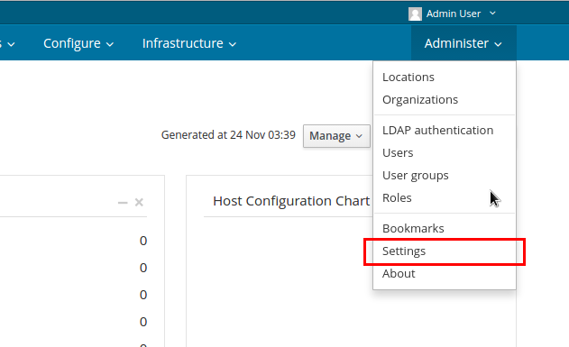
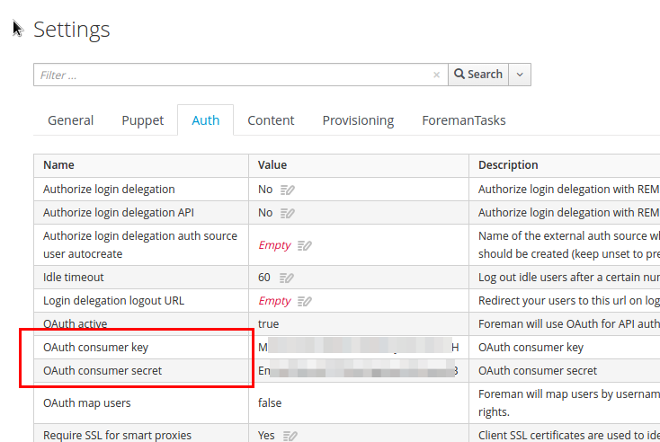
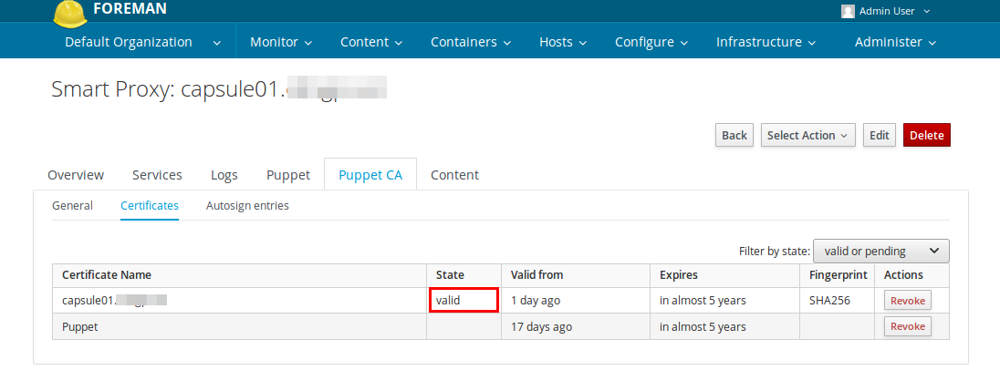

> Warning
> Before following this guide, the foreman/katello should set at least content, organization, location and product.


## Installation
### Register RPM Repositories
```
yum -y localinstall http://fedorapeople.org/groups/katello/releases/yum/3.2/katello/el7/x86_64/katello-repos-latest.rpm
yum -y localinstall http://yum.theforeman.org/releases/1.13/el7/x86_64/foreman-release.rpm
yum -y localinstall https://yum.puppetlabs.com/puppetlabs-release-pc1-el-7.noarch.rpm
yum -y localinstall http://dl.fedoraproject.org/pub/epel/epel-release-latest-7.noarch.rpm
yum -y install foreman-release-scl
```

### Basic Settings
#### Hostname
Before running installer, you need to set the hostname properly.

But you'd better set these on the DNS server you use.
```
[root@localhost ~]# hostnamectl set-hostname capsule01.example.local
[root@localhost ~]# systemctl restart systemd-hostnamed.service
```

**On capsule**
```
IP=$(ip addr |grep eth0: -A 2 | tail -n 1 | awk '{ gsub("/24","",$2); print $2 }')
FQDN=$(hostname -f)
HOSTNAME=$(echo $FQDN | awk -F '.'  '{print $1}')

echo "${IP} ${FQDN} ${HOSTNAME}"  >> /etc/hosts
echo "172.16.0.87 katello01.example.local katello.example.local katello foreman" >> /etc/hosts
```
***On Foreman/Katello***
Foreman/Katello  and Capsules need to communicate each other, otherwise, the installation will fail.

Therefore we should set capsule's host information on the katello server.

eg) 172.16.0.77 capsule01.example.local
```
echo "<CAPSULE SERVER IP> <CAPSULE SERVER FQDN>"  >> /etc/hosts
```

#### Firewall
TODO

### Installation
Install packages:
```
yum -y install katello-capsule
```
#### Fixes compatability issue with Puppet 4
```
/opt/puppetlabs/puppet/bin/gem install yard
source /etc/profile.d/puppet-agent.sh
puppet module install puppetlabs/strings
```
Generate a certificate for the new Capsule
You need to generate a certificate for the new capsule server on the foreman/katello server as below.
```
 capsule-certs-generate --capsule-fqdn "<NEW CAPSULE's FQDN>" --certs-tar "~/<NEW CAPSULE's FQDN>.tar"
```
```
[root@katello01 ~]# capsule-certs-generate --capsule-fqdn "capsule01.example.local" --certs-tar "/var/www/html/pub/capsule01.example.local.tar"
Installing             Done                                               [100%] [..........................................................................]
  Success!

  To finish the installation, follow these steps:

  If you do not have the smartproxy registered to the Katello instance, then please do the following:

  1. yum -y localinstall http://katello01.example.local/pub/katello-ca-consumer-latest.noarch.rpm
  2. subscription-manager register --org "Default_Organization"

  Once this is completed run the steps below to start the smartproxy installation:

  1. Ensure that the foreman-installer-katello package is installed on the system.
  2. Copy /var/www/html/pub/capsule01.example.local.tar to the system capsule01.example.local
  3. Run the following commands on the capsule (possibly with the customized
     parameters, see foreman-installer --scenario capsule --help and
     documentation for more info on setting up additional services):

  foreman-installer --scenario capsule\
                    --capsule-parent-fqdn                         "katello01.example.local"\
                    --foreman-proxy-register-in-foreman           "true"\
                    --foreman-proxy-foreman-base-url              "https://katello01.example.local"\
                    --foreman-proxy-trusted-hosts                 "katello01.example.local"\
                    --foreman-proxy-trusted-hosts                 "capsule01.example.local"\
                    --foreman-proxy-oauth-consumer-key            "i3yK4ngX2f9zuJ6JKiMkEYm5DgEfwC9D"\
                    --foreman-proxy-oauth-consumer-secret         "7anESptGYZhWMeEC5Dzbcrs9DjwaimYv"\
                    --capsule-pulp-oauth-secret                   "JfCFRw4hdRX52Gsr6VzEaVFNGf7n5P7x"\
                    --capsule-certs-tar                           "/var/www/html/pub/capsule01.example.local.tar"

```
#### Copy generated certificate file
I used scp command to retrieve a file as below.
```
cd ~/
wget https://katello01.example.local/pub/`hostname -f`.tar --no-check-certificate 
```

### Register Capsule server to Foreman/Katello server.
#### Install Foreman/Katello's CA certificate
You need to install Foreman/Katello's CA certificate in the capsule server via this command
```
yum install -y http://katello01.example.local/pub/katello-ca-consumer-latest.noarch.rpm
```
#### Register the Capsule server
```
subscription-manager register --org "Default_Organization"
```
```
[root@capsule01 ~]# subscription-manager register --org "Default_Organization"
Registering to: katello01.example.local:443/rhsm
Username: admin
Password: 
The system has been registered with ID: dfc41a04-c6f6-4f85-990d-ddb737a82696 
```

### (Optional) Setting PuppetDB integration
If you are willing to integrate Foreman/Katello with PuppetDB, you should set these value in the hiera file (/usr/share/foreman-installer/config/foreman.hiera/RedHat.yaml).

There's no other way to set PuppetDB via foreman-installer so far.

```
puppet::server_reports: puppetdb,foreman
puppet::server_puppetdb_host: puppetdb.example.local
puppet::server::storeconfigs_backend: puppetdb
puppetdb::master::config::strict_validation: false
```
### (Optional) Setting Alternative DNS names on Puppet certificate
If you are willing to set common name for your servers, you should set the puppet::dns_alt_names hiera value in the hiera file (/usr/share/foreman-installer/config/foreman.hiera/RedHat.yaml).

I found that there's no way to set alternative dns names via foreman-installer.
```
puppet::dns_alt_names:
  - katello.example.local
  - puppet.example.local
  - puppet
```

> I just want to add PuppetDB specific configuration into the puppet server's configuration.
> so I set puppetdb::master::config::strict_validation to false. it makes puppetdb module to skip connection validation between Foreman/Katello(actually PuppetServer)  and PuppetDB.


> Note that
If you were already installed capsule once, use this command to refresh your Puppet configuration
```
foreman-installer --scenario capsule --upgrade-puppet
```


### Run foreman-installer
The oauth-consumer-key and oauth-consumer-secret can be retrieved from the Foreman web UI as below:

 


Default way:
```
  foreman-installer --scenario capsule\
                    --capsule-parent-fqdn                         "katello01.example.local"\
                    --foreman-proxy-register-in-foreman           "true"\
                    --foreman-proxy-foreman-base-url              "https://katello01.example.local"\
                    --foreman-proxy-trusted-hosts                 "katello01.example.local"\
                    --foreman-proxy-trusted-hosts                 "capsule01.example.local"\
                    --foreman-proxy-oauth-consumer-key            "i3yK4ngX2f9zuJ6JKiMkEYm5DgEfwC9D"\
                    --foreman-proxy-oauth-consumer-secret         "7anESptGYZhWMeEC5Dzbcrs9DjwaimYv"\
                    --capsule-pulp-oauth-secret                   "JfCFRw4hdRX52Gsr6VzEaVFNGf7n5P7x"\
                    --capsule-certs-tar                           "/root/capsule01.example.local.tar" \
                    --foreman-proxy-bind-host '0.0.0.0'
```

> * You should change the path of the capsule certificate tar file properly. In this example, I change to /root.
> * I set the foreman-proxy-bind-host to '0.0.0.0' to solve TCP already listening related error.

### Configuration
#### Certificate Signing
After installing capsule server, you should navigate to the Smart proxy menu and click sign button.

If you press the sign button, the capsule server will request signing to katello server.

After signing is done, you will get the valid state as below.

