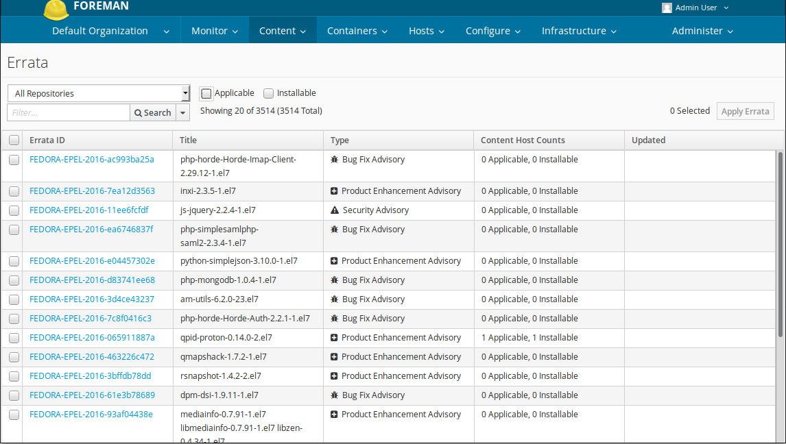
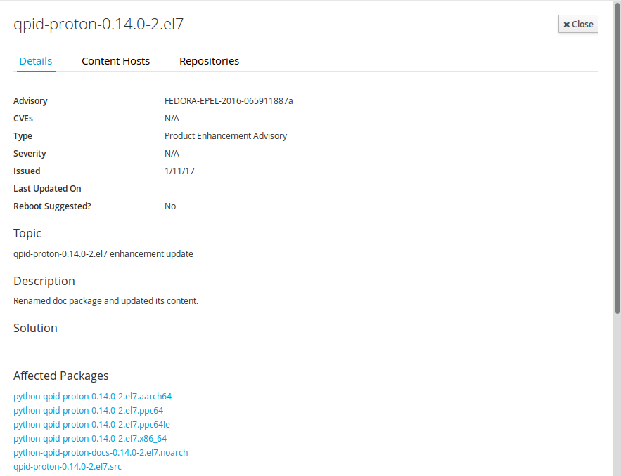
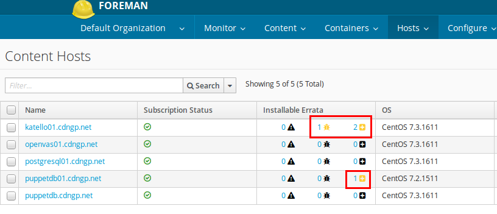
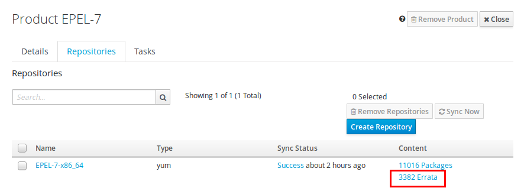
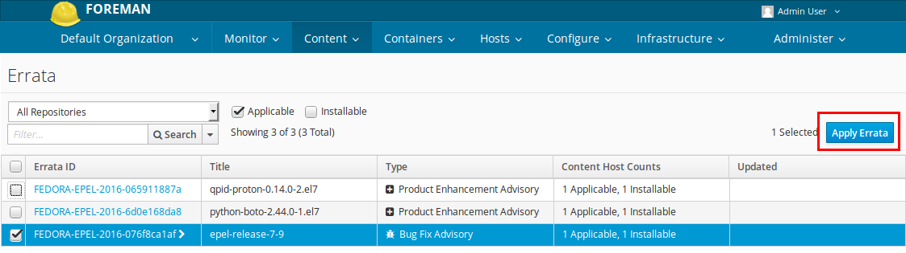
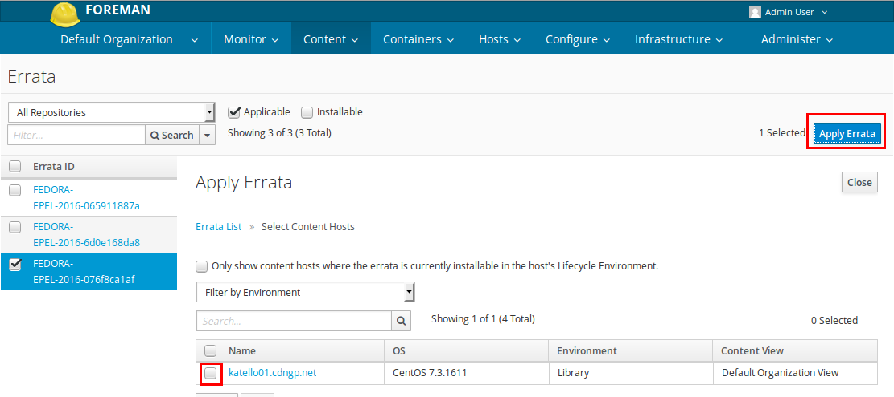
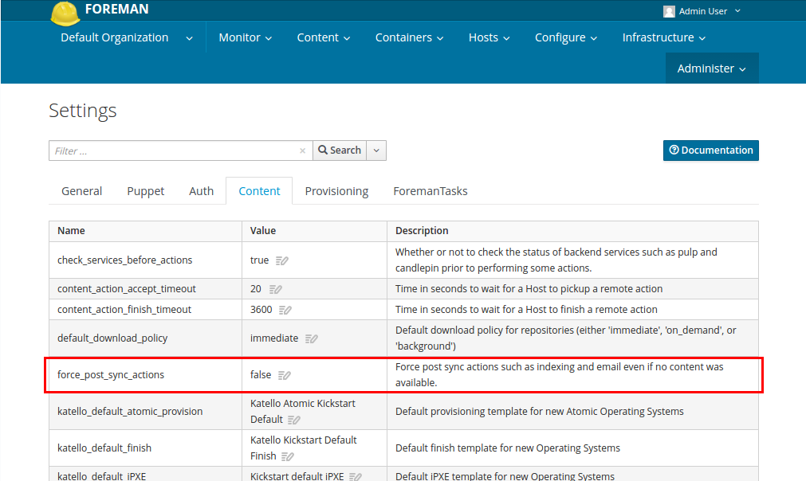
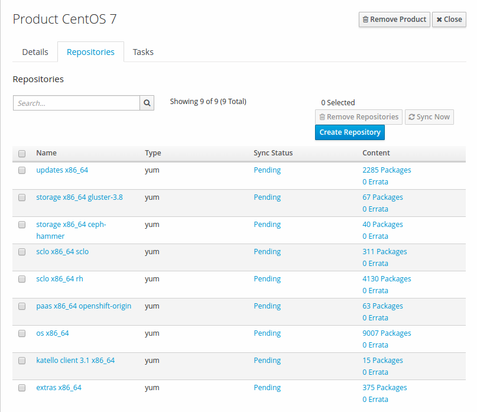
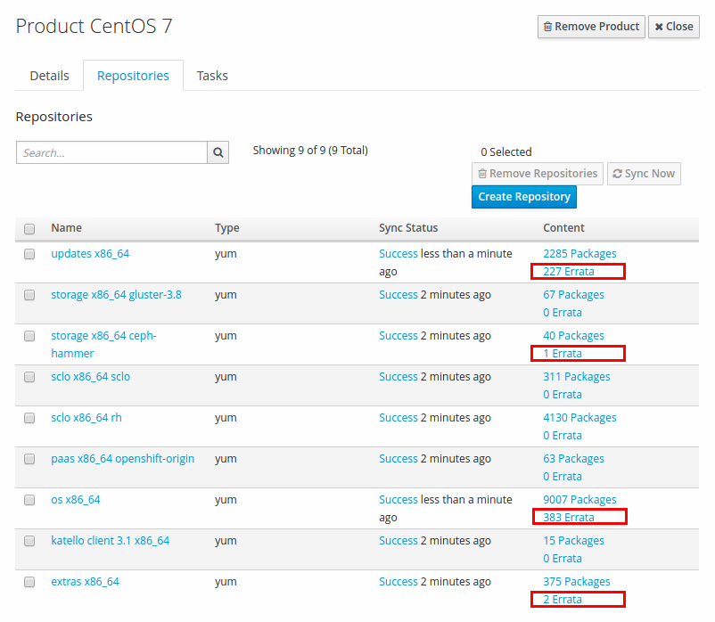

# Errata
[https://theforeman.org/plugins/katello/3.2/user_guide/errata/index.html]

Errata are updates between major releases. An Erratum is metadata about a group of packages that explains the importance of the package updates. Errata may be released individually on an as-needed basis or aggregated as a minor release. There are three main types of errata:

* Enhancement: the new packages contain one or more added features
* Bugfix: the new packages contain one or more bug fixes
* Security: the new packages fix one or more security vulnerabilities
With regard to Content Hosts, Errata is divided into two distinct classifications depending on whether or not the Errata is present in the Content Host’s Lifecycle Environment and Content View:

* Applicable: the errata applies to one or more Content Hosts
* Installable: the errata applies to one or more Content Hosts and is present in the Content Host’s Lifecycle Environment and Content View

## General Features
The following is a high-level summary of the Errata features:

View List of Errata


View Errata Details


View Affected Content Hosts


View Repositories Containing Errata


Applying Errata



## Importing CentOS Errata
### How to import CentOS Errata into the CentOS repository
The CentOS repositories do not come with a updateinfo.xml file that includes the relevant data that the plugin uses.

Fortuanately, the [CEFS project](http://cefs.steve-meier.de/) data and utilize the functionality of the updateinfo.xml file.

All we needed to do is convert the errata.xml data in to the appropriate updateinfo.xml format and inject it in to the applicable CentOS repositories via [pulp_centos_errata_import](https://github.com/brdude/pulp_centos_errata_import).

#### Ready for using pulp_centos_errata_import.
The pulp_centos_errata_import script imports CentOS Errata into Katello. It relies on preformatted information since parsing email is the road to madness...

To run this script on CenOS you need to install several packages:

- pulp-admin-client
- pulp-rpm-admin-extensions
- perl-XML-Simple
- perl-Text-Unidecode

In my case, I needed to install perl-Text-Unidecode and perl-XML-Simple.

```
yum install -y pulp-admin-client pulp-rpm-admin-extensions
yum install -y perl-Text-Unidecode perl-XML-Simple git

cd /usr/local/src
git clone https://github.com/brdude/pulp_centos_errata_import.git
cd /usr/local/src/pulp_centos_errata_import
chmod +x errata_import.pl

ln -s /usr/local/src/pulp_centos_errata_import/errata_import.pl /sbin/errata_import.pl

cat <<'EOF' > /usr/local/bin/import_centos_errata.sh
#!/bin/bash

wget -q -N -P /tmp http://cefs.steve-meier.de/errata.latest.xml.bz2
wget -q -N -P /tmp https://www.redhat.com/security/data/oval/com.redhat.rhsa-all.xml.bz2

bunzip2 -f /tmp/errata.latest.xml.bz2
bunzip2 -f /tmp/com.redhat.rhsa-all.xml.bz2

PASSWORD=$(grep -i ^default_password /etc/pulp/server.conf | awk '{print $2}')

/sbin/errata_import.pl --errata=/tmp/errata.latest.xml --rhsa-oval=/tmp/com.redhat.rhsa-all.xml --user=admin --password=$PASSWORD
EOF

chmod u+x /usr/local/bin/import_centos_errata.sh
```

> This script was modified from Steve Meier's script for spacewalk which can be found at http://cefs.steve-meier.de/
> The user name and password can be found under /etc/pulp/server.conf

#### Usage
1. Sync repositories
2. Run the script 
```
/usr/local/bin/import_centos_errata.sh
```
3. Go to Administer > Settings > Content(Tab) and set force_post_sync_action to true.

4. Sync repositories so that errata is published. (The errata will not show up on the Katello/Foreman interface until this step is completed. )

|Before|After|
|---|---|
|  |  |


#### Registering it as regular task via cron
If you run the script regular basis, you could link a file to anywhere such as /etc/cron.daily or /etc/cron.weekly.

```
cat <<'EOF' > /etc/cron.d/run_import_centos_errata.sh
/usr/local/bin/import_centos_errata.sh &> /var/log/import_centos_errata.log &
EOF
ln -s /etc/cron.d/run_import_centos_errata.sh /etc/cron.daily/run_import_centos_errata.sh
```
