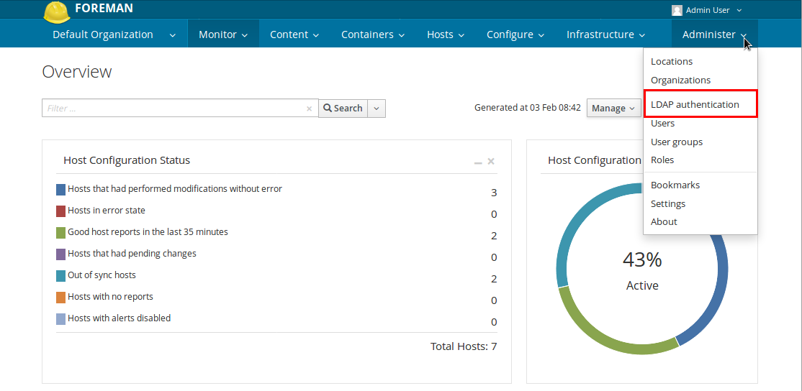
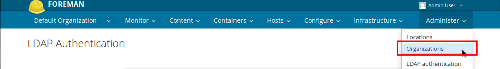
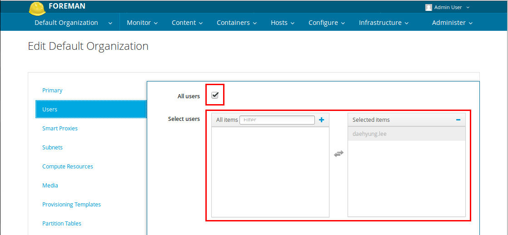

## LDAP Integration
Foreman includes the option to use a Lightweight Directory Access Protocol (LDAP) service for user information and authentication, using one or more LDAP directories.

In this guide, I assumed that you are using OpenLDAP server.

### Configure LDAP Authentication
You need to log in as the Administrator first and Go to the LDAP Authentication menu:

#### Create new LDAP source

#### Set LDAP Server tab
**In case of using OpenLDAP**

| Name	| Server|	LDAPS	|Port|	Server type|
|---|---|---|---|---|
|OpenLDAP	|<Your OpenLDAP's FQDN>|	Checked|	636	|POSIX|

#### Set Account tab
This is an example,  please change these as yours

|Key|	Value|
|---| ---|
|Accout username|	cn=manager,dc=example,dc=com|
|Account password|	<password>|
|Base DN	|ou=people,dc=example,dc=com|
|Group base DN|	ou=groups,dc=example,dc=com
|LDAP filter	|ß
|Automatically create accounts in Foreman|	Check|
|Usergroup sync|	Check|

#### Set Attribute mappings
|Key|	Value|
|---|---|
|Login name attribute	|uid|
|First name attribute|	givenName|
|Surname attribute	|sn|
|Email address attribute	|mail|
|Photo attribute| |	

### Modifying Organization
To work with LDAP account, you should set something on your organization, in this case, Default Organization.

You need to log in as the Administator first and go to the Organization settings page :

After opening the Organization settings page, you need to select User tap as below

Choose user who need to login or check the box beside of the All users message.

Afterwards when the user is linked to an organization you can assign the user a role via:
Administer > Users > click on user > Assign the desired role.

