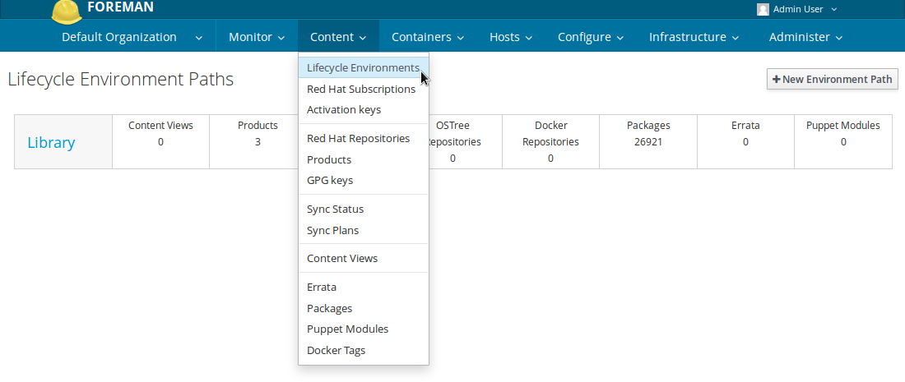
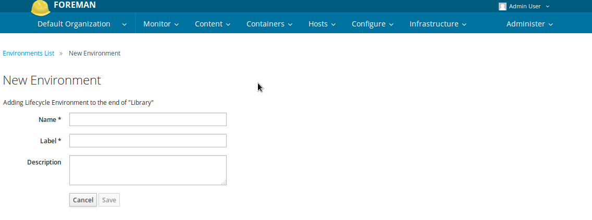

# Lifecycle Environments
What can a Lifecycle Environments be used for?

* Hold content view versions.
* To manage the lifecycle of Content Hosts.
* Establish workflow containers and promote content views.

## Definitions
* Lifecycle Environment - containers for content view versions which are consumed by content hosts.
* Library - a special kind of Lifecycle Environment that does not have a parent. The library serves as the main container for synced content such as products, puppet modules, and published content views. Every organization has a library. Subsequent environments are derived from the library. The first node of an environment is the Library, all future environments are derived from the library and follow the library in promotion order.
* Lifecycle Environment Path - Sequence of lifecycle environments that form the content promotion order.

## General Workflow
First create a lifecycle environment connected to the library life cycle environment and promote content views to the new lifecycle environment.
A Content Host can now register directly to the promoted content view in the promoted environment or library therein. Updates will be available as soon as new content is synced and promoted.

## Creating application life cycles
**Application Lifecycles Flow**

> Development	>	QA	>	Staging	>	Production

Navigate to Content > Lifecycle Environments.


Click New Environment Path to start a new application life cycle


### Devlopement Environment

|Key|	Value|	
|---|---|
|Name|	Development| |
|Label|	*Automatically completes*	|
|Description|	Environment for Development team or phase|

```
hammer lifecycle-environment create --name "Development" --description "Environment for Development team or phase" --prior "Library" --organization "Default Organization"
```

### QA Environment
|Key|	Value|	
|---|---|
|Name|	QA	|
|Label|	*Automatically completes*	|
|Description|	Environment for QA team or phase|	
```
hammer lifecycle-environment create --name "QA" --description "Environment for QA team or phase" --prior "Development" --organization "Default Organization"
```

### Staging Environment
|Key|	Value|	
|---|---|
|Name|	Staging	|
|Label|	*Automatically completes*|
|Description|	Environment for Staging phase|

```
hammer lifecycle-environment create --name "Staging" --description "Environment for staging phase" --prior "QA" --organization "Default Organization"
```

### Production Environment
|Key|	Value|	
|---|---|
|Name|	Production|	
|Label|	*Automatically completes*|	
|Description|	Environment for production release or phase	|

```
hammer lifecycle-environment create --name "Production" --description "Environment for production release or phase" --prior "Staging" --organization "Default Organization"
```

## Check


```
[root@katello-master ~]# hammer lifecycle-environment list --organization-id 1
---|-------------|------------
ID | NAME        | PRIOR      
---|-------------|------------
7  | Staging     | QA         
5  | QA          | Development
8  | Production  | Staging    
1  | Library     |            
4  | Development | Library    
---|-------------|------------

[root@katello-master ~]# hammer lifecycle-environment paths --organization-id 1
-----------------------------------------------------
LIFECYCLE PATH                                       
-----------------------------------------------------
Library >> Development >> QA >> Staging >> Production
-----------------------------------------------------```