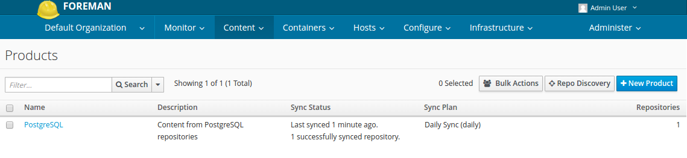
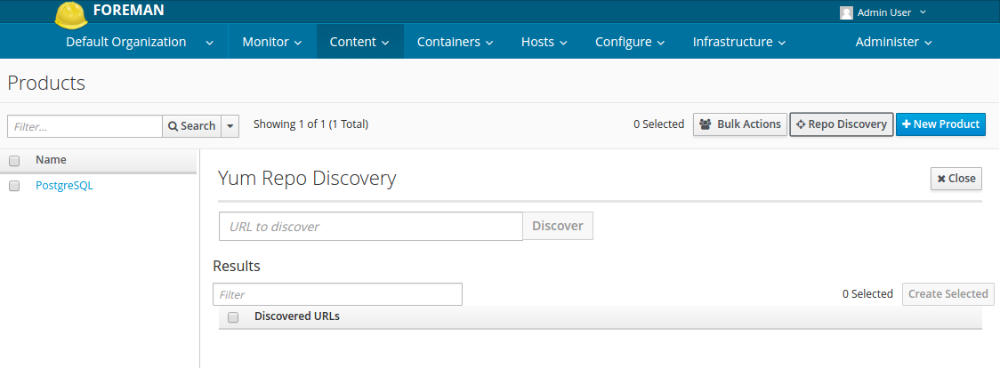
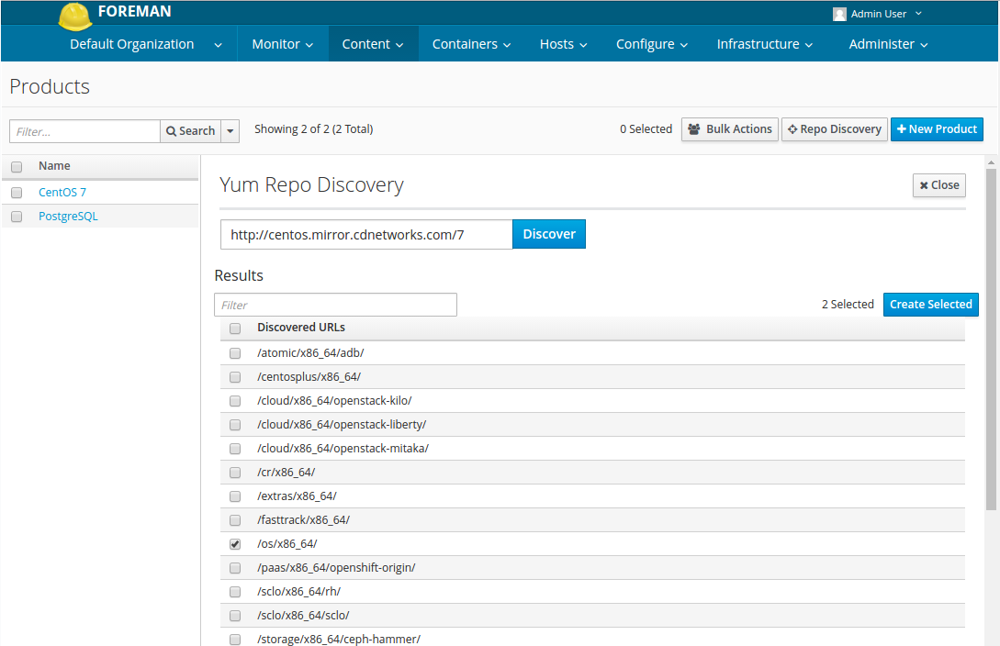
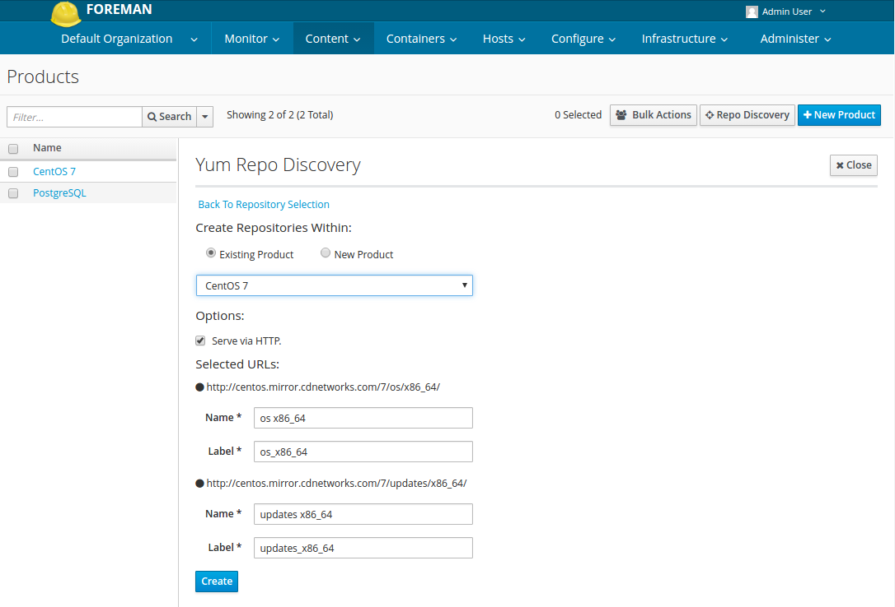
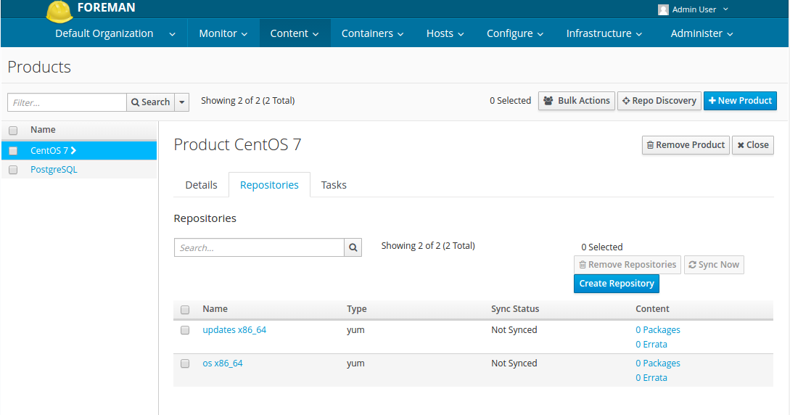

# Products for CentOS 6 and 7

## Creating Yum repositories for CentOS 6

Let's create a product, CentOS 6 and also create some of yum repositories.

I will use hammer to create a product and the other things right now

### Creating a GPG key
| Key|	Value	| Note |
|---|---|---|
|Name|	CentOS 6| |	
|Content	| Upload GPG Key|	[Download URL](http://centos.mirror.cdnetworks.com/6/os/x86_64/RPM-GPG-KEY-CentOS-6)|

```
mkdir ~/tmp; cd ~/tmp
wget http://centos.mirror.cdnetworks.com/6/os/x86_64/RPM-GPG-KEY-CentOS-6
hammer gpg create --key ./RPM-GPG-KEY-CentOS-6 --name "CentOS 6" --organization "Default Organization"
```

### Check
> Note that I've already created another products such as PostgreSQL 9.5 and CentOS 7

```
[root@katello-master tmp]# hammer gpg list --organization "Default Organization"
---|---------------
ID | NAME          
---|---------------
1  | PostgreSQL 9.5
2  | CentOS 7      
3  | CentOS 6      
---|---------------
```

### Creating a product for CentOS 7
| Key|	Value	| Note |
|---|---|---|
|Name|	CentOS 6| |	
|Label|	*automatically completes* |	
|GPG Key|	CentOS 6| |
|Sync Plan|	Daily Sync|	**Look at the Synchronization Plan**|
|Description|	Content from the CentOS repository| |	
```
hammer product create --name "CentOS 6" --gpg-key "CentOS 6" --sync-plan "Daily Sync" --description "Content from the CentOS 6 repository" --organization "Default Organization"
```

### Check

```
[root@katello-master tmp]# hammer product list --organization "Default Organization"
---|------------|--------------------------------------|----------------------|--------------|-----------
ID | NAME       | DESCRIPTION                          | ORGANIZATION         | REPOSITORIES | SYNC STATE
---|------------|--------------------------------------|----------------------|--------------|-----------
1  | PostgreSQL | Content from PostgreSQL repositories | Default Organization | 1            |           
2  | CentOS 7   | Content from the CentOS repository   | Default Organization | 8            |           
3  | CentOS 6   | Content from the CentOS 6 repository | Default Organization | 0            |           
---|------------|--------------------------------------|----------------------|--------------|-----------
```

### Creating Repos
I created several repositories as below:

|Name|	Product|	Content Type|	URL|
|---|---|---|---|
|os| x86_64|CentOS 6|yum|	http://centos.mirror.cdnetworks.com/6/os/x86_64/|
|updates x86_64	|CentOS 6	|yum|	http://centos.mirror.cdnetworks.com/6/updates/x86_64/|
|extras x86_64	|CentOS 6|	yum|	http://centos.mirror.cdnetworks.com/6/extras/x86_64/|
|storage x86_64 gluster-3.7	|CentOS 6|	yum|	http://centos.mirror.cdnetworks.com/6/storage/x86_64/gluster-3.7/|
|storage x86_64 gluster-3.8|	CentOS 6|	yum|	http://centos.mirror.cdnetworks.com/6/storage/x86_64/gluster-3.8/|
|sclo x86_64 rh|	CentOS 6|	yum	|http://centos.mirror.cdnetworks.com/6/sclo/x86_64/rh/|
|sclo x86_64 sclo	|CentOS 6|	yum	|http://centos.mirror.cdnetworks.com/6/sclo/x86_64/sclo/|
|katello client x86_64	|CentOS 6	|yum	|https://fedorapeople.org/groups/katello/releases/yum/3.1/client/el6/x86_64/|

```
hammer repository create --name "os x86_64" --product "CentOS 6" --content-type yum --download-policy "immediate" --gpg-key "CentOS 6" --organization "Default Organization" --url "http://centos.mirror.cdnetworks.com/6/os/x86_64/"
hammer repository create --name "updates x86_64" --product "CentOS 6" --content-type yum --download-policy "immediate" --gpg-key "CentOS 6" --organization "Default Organization" --url "http://centos.mirror.cdnetworks.com/6/updates/x86_64/"
hammer repository create --name "extras x86_64" --product "CentOS 6" --content-type yum --download-policy "immediate" --gpg-key "CentOS 6" --organization "Default Organization" --url "http://centos.mirror.cdnetworks.com/6/extras/x86_64/"
hammer repository create --name "storage x86_64 gluster-3.7" --product "CentOS 6" --content-type yum --download-policy "immediate" --gpg-key "CentOS 6" --organization "Default Organization" --url "http://centos.mirror.cdnetworks.com/6/storage/x86_64/gluster-3.7"
hammer repository create --name "storage x86_64 gluster-3.8" --product "CentOS 6" --content-type yum --download-policy "immediate" --gpg-key "CentOS 6" --organization "Default Organization" --url "http://centos.mirror.cdnetworks.com/6/storage/x86_64/gluster-3.8"
hammer repository create --name "sclo x86_64 rh" --product "CentOS 6" --content-type yum --download-policy "immediate" --gpg-key "CentOS 6" --organization "Default Organization" --url "http://centos.mirror.cdnetworks.com/6/sclo/x86_64/rh"
hammer repository create --name "sclo x86_64 sclo" --product "CentOS 6" --content-type yum --download-policy "immediate" --gpg-key "CentOS 6" --organization "Default Organization" --url "http://centos.mirror.cdnetworks.com/6/sclo/x86_64/sclo"
hammer repository create --name "katello client 3.1 x86_64" --product "CentOS 6" --content-type yum --download-policy "immediate" --organization "Default Organization" --url "https://fedorapeople.org/groups/katello/releases/yum/3.1/client/el6/x86_64/"
```

### Check

```
[root@katello-master ~]# hammer repository list --organization "Default Organization" --product "CentOS 6"
---|----------------------------|----------|--------------|----------------------------------------------------------------------------
ID | NAME                       | PRODUCT  | CONTENT TYPE | URL                                                                        
---|----------------------------|----------|--------------|----------------------------------------------------------------------------
15 | updates x86_64             | CentOS 6 | yum          | http://centos.mirror.cdnetworks.com/6/updates/x86_64/                      
18 | storage x86_64 gluster-3.8 | CentOS 6 | yum          | http://centos.mirror.cdnetworks.com/6/storage/x86_64/gluster-3.8           
17 | storage x86_64 gluster-3.7 | CentOS 6 | yum          | http://centos.mirror.cdnetworks.com/6/storage/x86_64/gluster-3.7           
20 | sclo x86_64 sclo           | CentOS 6 | yum          | http://centos.mirror.cdnetworks.com/6/sclo/x86_64/sclo                     
19 | sclo x86_64 rh             | CentOS 6 | yum          | http://centos.mirror.cdnetworks.com/6/sclo/x86_64/rh                       
14 | os x86_64                  | CentOS 6 | yum          | http://centos.mirror.cdnetworks.com/6/os/x86_64/                           
21 | katello client 3.1 x86_64  | CentOS 6 | yum          | https://fedorapeople.org/groups/katello/releases/yum/3.1/client/el6/x86_64/
16 | extras x86_64              | CentOS 6 | yum          | http://centos.mirror.cdnetworks.com/6/extras/x86_64/                       
---|----------------------------|----------|--------------|----------------------------------------------------------------------------
```


## Creating Yum repositories for CentOS 7
Let's create a product, CentOS 7 and also create some of yum repositories.

I will use hammer to create a product and the other things right now

### Creating a GPG key
| Key|	Value	| Note |
|---|---|---|
| Name|	CentOS 7| |	
|Content|	Upload GPG Key|	[Download URL](http://centos.mirror.cdnetworks.com/7/os/x86_64/RPM-GPG-KEY-CentOS-7) |

```
mkdir ~/tmp; cd ~/tmp
wget http://centos.mirror.cdnetworks.com/7/os/x86_64/RPM-GPG-KEY-CentOS-7
hammer gpg create --key ./RPM-GPG-KEY-CentOS-7 --name "CentOS 7" --organization "Default Organization"
```

### Check

```
[root@katello-master tmp]# hammer gpg list --organization "Default Organization"
---|---------------
ID | NAME          
---|---------------
1  | PostgreSQL 9.5
2  | CentOS 7      
3  | CentOS 6      
---|---------------
```

### Creating a product for CentOS 7

| Key|	Value	| Note |
|---|---|---|
|Name	|CentOS 7	||
|Label|	*automatically completes*||
|GPG Key|	CentOS 7	| |
|Sync Plan|	Daily Sync|	**Look at the Synchronization Plan** |
|Description	|Content from the CentOS 7 repository||	
```
hammer product create --name "CentOS 7" --gpg-key "CentOS 7" --sync-plan "Daily Sync" --description "Content from the CentOS 7 repository" --organization "Default Organization"
```

### Check
```
[root@katello-master tmp]# hammer product list --organization "Default Organization"
---|------------|--------------------------------------|----------------------|--------------|-----------
ID | NAME       | DESCRIPTION                          | ORGANIZATION         | REPOSITORIES | SYNC STATE
---|------------|--------------------------------------|----------------------|--------------|-----------
1  | PostgreSQL | Content from PostgreSQL repositories | Default Organization | 1            |           
2  | CentOS 7   | Content from the CentOS 7 repository | Default Organization | 8            |           
3  | CentOS 6   | Content from the CentOS 6 repository | Default Organization | 0            |           
---|------------|--------------------------------------|----------------------|--------------|-----------
```

### Creating Repos
I created several repositories as below:

|Name|	Product|	Content Type|	URL|
|---|---|---|---|
|os x86_64| CentOS 7|	yum|http://centos.mirror.cdnetworks.com/7/os/x86_64/
|updates x86_64|	CentOS 7	|yum	|http://centos.mirror.cdnetworks.com/7/updates/x86_64/|
|extras x86_64|	CentOS 7	|yum	|http://centos.mirror.cdnetworks.com/7/extras/x86_64/|
|storage x86_64 ceph-hammer|	CentOS 7|	yum|	http://centos.mirror.cdnetworks.com/7/storage/x86_64/ceph-hammer/|
|storage x86_64 gluster-3.7|	CentOS 7	|yum|	http://centos.mirror.cdnetworks.com/7/storage/x86_64/gluster-3.7/|
|storage x86_64 gluster-3.8	|CentOS 7|	yum	|http://centos.mirror.cdnetworks.com/7/storage/x86_64/gluster-3.8/|
|sclo x86_64 rh	|CentOS 7	|yum	|http://centos.mirror.cdnetworks.com/7/sclo/x86_64/rh/|
|sclo x86_64 sclo	|CentOS 7|	yum	|http://centos.mirror.cdnetworks.com/7/sclo/x86_64/sclo/|
|paas x86_64 openshift-origin|	CentOS 7|	yum	|http://centos.mirror.cdnetworks.com/7/paas/x86_64/openshift-origin/|

```
hammer repository create --name "os x86_64" --product "CentOS 7" --content-type yum --download-policy "immediate" --gpg-key "CentOS 7" --organization "Default Organization" --url "http://centos.mirror.cdnetworks.com/7/os/x86_64/"
hammer repository create --name "updates x86_64" --product "CentOS 7" --content-type yum --download-policy "immediate" --gpg-key "CentOS 7" --organization "Default Organization" --url "http://centos.mirror.cdnetworks.com/7/updates/x86_64/"
hammer repository create --name "extras x86_64" --product "CentOS 7" --content-type yum --download-policy "immediate" --gpg-key "CentOS 7" --organization "Default Organization" --url "http://centos.mirror.cdnetworks.com/7/extras/x86_64/"
hammer repository create --name "storage x86_64 ceph-hammer" --product "CentOS 7" --content-type yum --download-policy "immediate" --gpg-key "CentOS 7" --organization "Default Organization" --url "http://centos.mirror.cdnetworks.com/7/storage/x86_64/ceph-hammer"
hammer repository create --name "storage x86_64 gluster-3.7" --product "CentOS 7" --content-type yum --download-policy "immediate" --gpg-key "CentOS 7" --organization "Default Organization" --url "http://centos.mirror.cdnetworks.com/7/storage/x86_64/gluster-3.7"
hammer repository create --name "storage x86_64 gluster-3.8" --product "CentOS 7" --content-type yum --download-policy "immediate" --gpg-key "CentOS 7" --organization "Default Organization" --url "http://centos.mirror.cdnetworks.com/7/storage/x86_64/gluster-3.8"
hammer repository create --name "sclo x86_64 rh" --product "CentOS 7" --content-type yum --download-policy "immediate" --gpg-key "CentOS 7" --organization "Default Organization" --url "http://centos.mirror.cdnetworks.com/7/sclo/x86_64/rh"
hammer repository create --name "sclo x86_64 sclo" --product "CentOS 7" --content-type yum --download-policy "immediate" --gpg-key "CentOS 7" --organization "Default Organization" --url "http://centos.mirror.cdnetworks.com/7/sclo/x86_64/sclo"
hammer repository create --name "paas x86_64 openshift-origin" --product "CentOS 7" --content-type yum --download-policy "immediate" --gpg-key "CentOS 7" --organization "Default Organization" --url "http://centos.mirror.cdnetworks.com/7/paas/x86_64/openshift-origin/"
```

### Check

```
[root@katello-master ~]# hammer repository list --organization "Default Organization" --product "CentOS 7"
---|------------------------------|----------|--------------|----------------------------------------------------------------------------
ID | NAME                         | PRODUCT  | CONTENT TYPE | URL                                                                        
---|------------------------------|----------|--------------|----------------------------------------------------------------------------
3  | updates x86_64               | CentOS 7 | yum          | http://centos.mirror.cdnetworks.com/7/updates/x86_64/                      
6  | storage x86_64 gluster-3.8   | CentOS 7 | yum          | http://centos.mirror.cdnetworks.com/7/storage/x86_64/gluster-3.8/          
5  | storage x86_64 ceph-hammer   | CentOS 7 | yum          | http://centos.mirror.cdnetworks.com/7/storage/x86_64/ceph-hammer/          
13 | sclo x86_64 sclo             | CentOS 7 | yum          | http://centos.mirror.cdnetworks.com/7/sclo/x86_64/sclo/                    
12 | sclo x86_64 rh               | CentOS 7 | yum          | http://centos.mirror.cdnetworks.com/7/sclo/x86_64/rh/                      
4  | paas x86_64 openshift-origin | CentOS 7 | yum          | http://centos.mirror.cdnetworks.com/7/paas/x86_64/openshift-origin/        
7  | os x86_64                    | CentOS 7 | yum          | http://centos.mirror.cdnetworks.com/7/os/x86_64/                           
11 | extras x86_64                | CentOS 7 | yum          | http://centos.mirror.cdnetworks.com/7/extras/x86_64/                       
---|------------------------------|----------|--------------|----------------------------------------------------------------------------
```

## Repository Discovery
The Products page in the Web UI also provides a Repo Discovery function that finds all repositories from a URL and allows you to select which ones to add to your custom Product.

Let's create some CentOS Yum repositories via this function.



### Creating a GPG key
> Follow the above method

### Creating a CentOS product
> Follow the above method
	
### Repo Discovery
Navigate to **Content** > **Products**. Click **Repo Discovery**.



|Key|	Value|	
|---|---|
|URL to discover|	http://centos.mirror.cdnetworks.com/7|	
After input URL to discover, Click **Discover**.

Discover function will find repositories from the URL you entered.

### Creating repositories with discovered URLs
I selected just few repositories from discovered repositories.
You could add more repositories by the same method later.



**Choose** these and Click **Create Selected**

* /os/x86_64
* /updates/x86_64



**Select** CentOS 7 from the Existing Product and Click **Create**.

### Synchronizing
**Select** all repositories and Click **Sync Now**.

