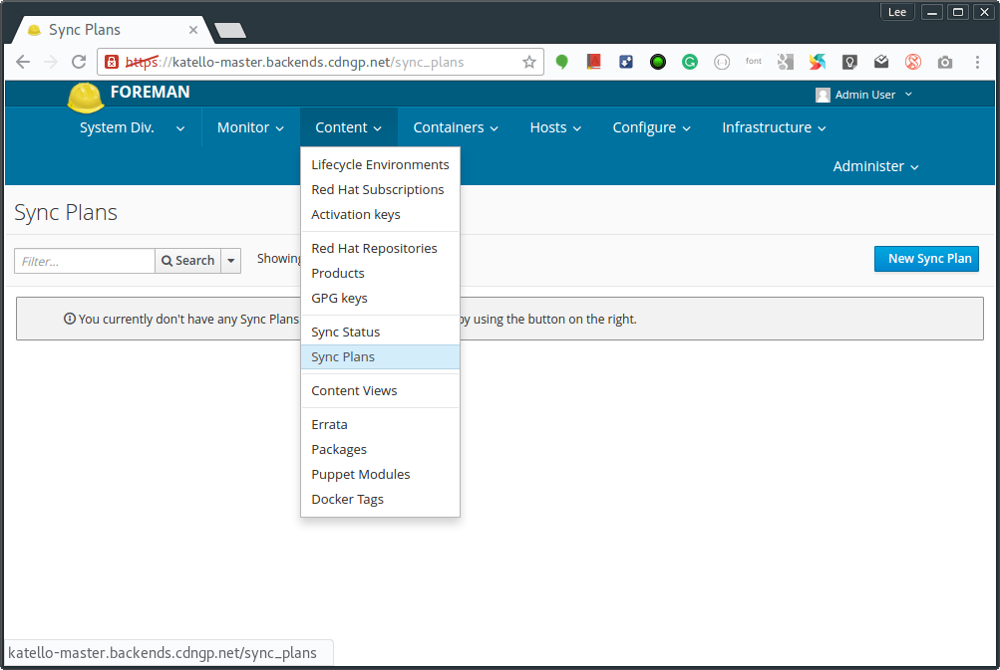
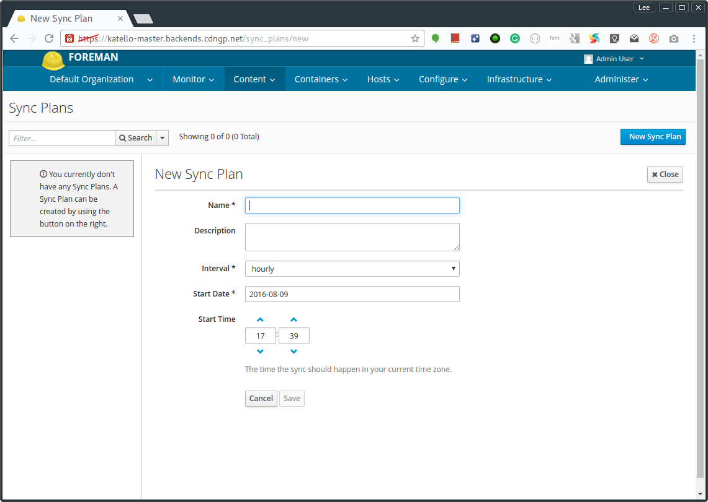

# Synchronization plan
A synchronization plan checks and updates the content in you Definitive Media Library(DML) at a regularly scheduled date and time.





|Key|	Value|
|---|---|
|Name|Daily Sync|
|Description|Daily basis sync plan|
|Interval	|daily|
|Start Date	|2016-08-09|
|Start Time	|01:00:00|

**Using CLI**
```
hammer sync-plan create --name "Daily Sync" --description "Daily basis sync plan" --interval daily --sync-date "2016-08-09 01:00:00" --enabled true --organization "Default Organization"
```