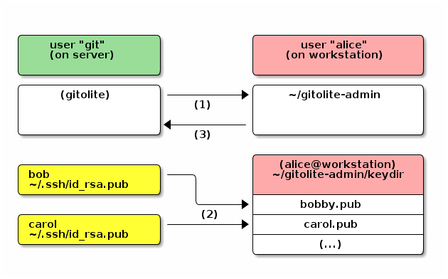

# Gitolite Installation

* last updated: 14 Jan 2017
* http://tecadmin.net/install-git-2-0-on-centos-rhel-fedora/#

## Installing Git
### Requisites
```
yum update -y
yum install curl-devel expat-devel gettext-devel openssl-devel zlib-devel -y
yum install gcc 
yum install perl-ExtUtils-MakeMaker perl-Data-Dumper -y
```

### Building from source
At this time, 2.11.0 is the lastest one.
```
cd /usr/src
wget https://www.kernel.org/pub/software/scm/git/git-2.11.0.tar.gz
tar xzf git-2.11.0.tar.gz
ln -s git-2.11.0 git
cd git
make prefix=/usr/local/git all
make prefix=/usr/local/git install
cat <<'EOF' > /etc/profile.d/git.sh
#!/bin/bash
GIT_HOME=/usr/local/git
export PATH=$GIT_HOME/bin:$PATH
EOF
source /etc/profile.d/git.sh
```

### Checking
```
[root@gitolite git]# git --version
git version 2.11.0
```

## Installing Gitolite
### Adding system accounts
I created two accounts:

* git : this account contains git repositories
* gitolite-admin: gitolite admin account who can add or remove git user accounts

```
useradd -r -m -k /etc/skel git
echo "Njc5ZDEwNTIyN2RlNmQ4Y2ZiM2IzMWQ3" | passwd --stdin git

useradd -r -m -k /etc/skel gitolite-admin
echo "MzVkZDk4ZDU2YTlkN2E1ZjY3NTU1ZWVk" | passwd --stdin gitolite-admin
```

I generated a password with this command
```
date +%s | sha256sum |base64 |head -c 32;echo
```

### Get the latest source & Install
[Reference UR:](http://gitolite.com/gitolite/gitolite.html#install)

I used version 3.6.6 which is the lastest at this time.
```
cd /usr/local/
git clone https://github.com/sitaramc/gitolite.git -b "v3.6.6" /usr/local/gitolite
gitolite/install -ln /usr/local/bin
```

### Setup gitolite
For the first-time setup, you need to have a public key file ready. I followed these steps:

1. Create a SSH key by using gitolite-admin account
2. Copying gitolite-admin SSH public key into git account
3. Initializing the gitolite repository by using the gitolite-admin's SSH public key
4. Removing the public key used

```
su gitolite-admin -l
mkdir .ssh
ssh-keygen -b 4096 -f .ssh/gitolite_admin -C "administrator's ssh key for gitolite"
exit

(as a root) cp ~gitolite-admin/.ssh/gitolite_admin.pub ~git/
(as a root) chown git: ~git/gitolite_admin.pub

su git -l
gitolite setup -pk gitolite_admin.pub

rm gitolite_admin.pub
```

### Managing users
[http://gitolite.com/gitolite/basic-admin/]()



### Cloning gitolite-admin repo.
In order to manage user who can interact with gitolite, you need to clone the *gitolite-admin* repository first.

#### Changing SSH client settings
To use SSH public key as an identityfile, you need to create or modify your ssh config file.
```
[root@gitolite ~]# su gitolite-admin -l
[gitolite-admin@gitolite ~]$ cat <<EOF > .ssh/config
Identityfile $HOME/.ssh/gitolite_admin
EOF
[gitolite-admin@gitolite ~]$ chmod 700 .ssh/config
```

#### Cloning the gitolite-admin repo.
```
[gitolite-admin@gitolite ~]$ git clone git@localhost:gitolite-admin
Cloning into 'gitolite-admin'...
remote: Counting objects: 6, done.
remote: Compressing objects: 100% (4/4), done.
remote: Total 6 (delta 0), reused 0 (delta 0)
Receiving objects: 100% (6/6), done.
```

#### Adding/Removing users
In order to add or remove any account, follow these steps

1. copy users' SSH public key into the gitolite-admin account's directory.
2. log in as gitolite-admin account and copy any users' SSH public key into the gitolite-admin/keydir directory.
3. Rename the public key with a actual user's name which will be used as a login name.
4. Using these command to add:
```
git add keydir 
git commit keydir -m 'MESSAGE'
git push
```
5. To remove, remove user's public key and do the same commands:
```
git remove keydir/<KEY> 
git commit keydir/<KEY> -m 'MESSAGE' 
git push
```
**Example**
As an example, I added my SSH public key into the keydir
```
[gitolite-admin@gitolite ~]$ cd gitolite-admin/keydir/
[gitolite-admin@gitolite keydir]$ scp daehyung@10.40.192.44:~/.ssh/daehyung_rsa*.pub .
The authenticity of host '10.40.192.44 (10.40.192.44)' can't be established.
RSA key fingerprint is fb:d6:ee:52:0c:69:d4:48:37:ec:ea:f2:26:d2:fc:b2.
Are you sure you want to continue connecting (yes/no)? yes
Warning: Permanently added '10.40.192.44' (RSA) to the list of known hosts.
daehyung@10.40.192.44's password: 
daehyung_rsa-20150319.pub        
[gitolite-admin@gitolite keydir]$ mv daehyung_rsa-20150319.pub daehyung.lee.pub
[gitolite-admin@gitolite keydir]$ git add daehyung.lee.pub 
[gitolite-admin@gitolite keydir]$ git commit daehyung.lee.pub -m 'Added daehyung.lee'

*** Please tell me who you are.

Run

  git config --global user.email "you@example.com"
  git config --global user.name "Your Name"

to set your account's default identity.
Omit --global to set the identity only in this repository.

fatal: empty ident name (for <(null)>) not allowed

[gitolite-admin@gitolite keydir]$ git config --global user.email 'daehyung.lee@cdnetworks.com'
[gitolite-admin@gitolite keydir]$ git config --global user.name "Daehyung Lee"
[gitolite-admin@gitolite keydir]$ git config --global push.default simple
[gitolite-admin@gitolite keydir]$ git add daehyung.lee.pub 
[gitolite-admin@gitolite keydir]$ git commit daehyung.lee.pub -m 'added a key for daehyung.lee'
[master acd1e20] added a key for daehyung.lee
 1 file changed, 1 insertion(+)
 create mode 100644 keydir/daehyung.lee.pub

[gitolite-admin@gitolite keydir]$ git push
Counting objects: 8, done.
Compressing objects: 100% (7/7), done.
Writing objects: 100% (8/8), 1.36 KiB | 0 bytes/s, done.
Total 8 (delta 0), reused 0 (delta 0)
To git@172.16.1.9:gitolite-admin
   b14ea59..6c1b479  master -> master
```

As you noticed that I commanded **git config --global push.default simple** in the above, to change the behavior of the default push  since Git 2.0.

```
[daehyung.lee:gitolite-admin@h0-s4009.sys-dev2 ~/gitolite-admin/keydir]$ git push 
warning: push.default is unset; its implicit value has changed in
Git 2.0 from 'matching' to 'simple'. To squelch this message
and maintain the traditional behavior, use:

  git config --global push.default matching

To squelch this message and adopt the new behavior now, use:

  git config --global push.default simple

When push.default is set to 'matching', git will push local branches
to the remote branches that already exist with the same name.

Since Git 2.0, Git defaults to the more conservative 'simple'
behavior, which only pushes the current branch to the corresponding
remote branch that 'git pull' uses to update the current branch.

See 'git help config' and search for 'push.default' for further information.
(the 'simple' mode was introduced in Git 1.7.11. Use the similar mode
'current' instead of 'simple' if you sometimes use older versions of Git)
```

#### Managing Repositories
[http://gitolite.com/gitolite/gitolite.html#repos]()

To add a new repo, you have to clone the gitolite-admin repository, then edit the conf/gitolite.conf file. In that file, add the repo, along with at least one user with some permissions.

You can add the new repo in its own paragraph:
```
repo bar
    RW+     =   alice
```
You can also add it to an existing repo line, if the new repo is intended to have the same access rules.
```
repo foo bar
    RW+     =   alice
```
Also you can create and use a [repo group](http://gitolite.com/gitolite/gitolite.html#groups):
```
@myrepos    =   foo
@myrepos    =   bar
    .
    .
    .
@myrepos    =   zzq

repo @myrepos
    RW+     =   alice
```
Commit and push the changes. Gitolite will create a bare, empty, repo on the server that is ready to be cloned and pushed to.

### Managing ACL
#### Group
You can group repos or users for convenience. The syntax is the same for both and does not distinguish; until you use the group name it could really be either.
```
@developers     =   dilbert alice wally
```
You can use one group in another group definition; the values will be expanded immediately (meaning later additions will not appear in the second group). 
```
@developers     =   dilbert alice
@interns        =   ashok
@staff          =   @interns @developers
@developers     =   wally

# wally is NOT part of @staff
```
Here's a very simple but complete example of using groups:
```
@developers     =   dilbert alice wally
@foss-repos     =   git gitolite

repo @foss-repos
    RW+         =   @developers
```
**Example**
I configured gitolite.conf to my account be an administrator of the gitolite-admin:
```
[gitolite-admin@gitolite conf]$ cat gitolite.conf 
@git-admins = daehyung.lee

repo gitolite-admin
    RW+     =   gitolite_admin
    RW        =      @git-admins 

repo testing
    RW+     =   @all

[gitolite-admin@gitolite conf]$ git commit conf/gitolite.conf -m 'added a group, git-admins and added daehyung.lee as an administrator of the gitolite-admin'
[gitolite-admin@gitolite conf]$ git push
```

**Testing**
I cloned the gitolite-admin repository on my desktop for testing purpose. I can change the admin repository as below:
```
daehyung@daehyung-desktop:~/git/VCS$ cat ~/.ssh/config 
Host 10.40.205.70
    Port 2113
    Identityfile ~/.ssh/daehyung_rsa-20150319
    User daehyung.lee

daehyung@daehyung-desktop:~/git/VCS$ git clone git@10.40.205.70:gitolite-admin 
Cloning into 'gitolite-admin'...
remote: Counting objects: 14, done.
remote: Compressing objects: 100% (11/11), done.
remote: Total 14 (delta 0), reused 0 (delta 0)
Receiving objects: 100% (14/14), done.
Checking connectivity... done.
```

> I set the my IP address on the VCS server first to access SSH connection first.