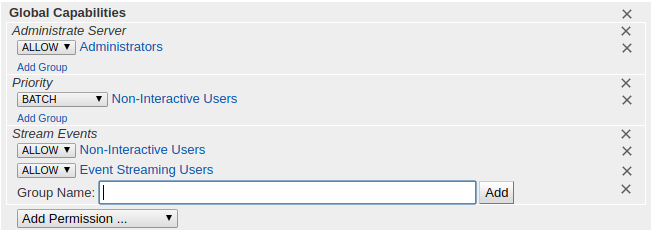
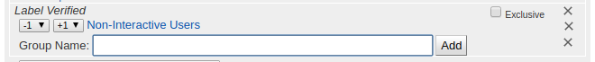

<style>
.indent {
  padding-left: 30px;
}

table {
  padding-left: 30px;
}

</style>
# Gerrit + Jenkins 
## Gerrit Trigger

MORE TESTING REQUIRES

[https://wiki.jenkins.io/display/JENKINS/Gerrit+Trigger]

Jenkins can integrate with Gerrit code review by using Gerrit trigger plugin.

**Check this**
> I assumed that you have already an account in Gerrit review system. it means you can push codes to the Gerrit review system from your machine.

### Generate SSH key on Jenkins
```
cd ~jenkins
mkdir .ssh
ssh-keygen -t rsa -b 2048 -C "SSH key to access gerrit - $(date +%F)" -f .ssh/gerrit_trigger_rsa
chown -R jenkins: .ssh
```

---
**In case of using Jenkins Docker image**
If you use Jenkins docker image instead of the package, you need to create a key file in the jenkins_home directory.

Also, you need to set uid/gid on the key file cause Jenkins docker image uses jenkins account(UID 1000, GID 1000) internally.

* directory: /jenkins_home
* uid/gid: 1000/1000

```
cd /jenkins_home
mkdir .ssh
ssh-keygen -t rsa -b 2048 -C "SSH key to access gerrit - $(date +%F)" -f .ssh/gerrit_trigger_rsa
chown -R 1000:1000 .ssh
```

Now You may copy the SSH public key to your machine before following below processes.

---

### Create an account on Gerrit review system
> To create any account on jenkins via SSH, you need to get a permission of administrator of gerrit system.


You can create an account in Gerrit review system by running the 'gerrit' command with proper options.

*On your machine or other machine which can access gerrit review system*
```
cat gerrit_trigger_rsa.pub | ssh -p29418 <gerrit FQDN> gerrit create-account --ssh-key - jenkins
```

*You may need to restart your gerrit service to detect your new account jenkins.*


## Adding Label:Verified

[Open the reference page](https://gerrit-documentation.storage.googleapis.com/Documentation/2.13.3/config-labels.html#label_Verified)

---

The Verified label was originally invented by the Android Open Source Project to mean 'compiles, passes basic unit tests'. 
Some CI tools expect to use the Verified label to vote on a change after running.

**The range of values**

| Score | Result | Description |
| ------- | -------- | ---------------- |
| -1 | Fails | Tried to compile, but got a compile error, or tried to run tests, but one or more tests did not pass.</br> **Any -1 blocks submit.** |
|  0 | No score |   Didn’t try to perform the verification tasks. |
| +1 | Verified|  Compiled (and ran tests) successfully.</br>**Any +1 enables submit.** |

---
### 1. Edit All-Projects config
<span class="indent"></span>
<span class="indent"></span>

### 2. Add these into the configuration as below
```
[label "Verified"]
        function = MaxWithBlock
        value = -1 Fails
        value =  0 No score
        value = +1 Verified
        copyAllScoresIfNoCodeChange = true
```

### 3. Save and Publish this setting

## Configuring Gerrit access right

* **Log in** to the Gerrit web interface with any account who has administrator privileges.
* Go to **People** > **List Groups** > **Non-Interactive Users**

<span class="indent"></span>

* **Add** your **jenkins user** into a group, **Non-Interactive Users** by entering the name in the input box, when you typed the name it will show you the name as below

<span class="indent"></span>

* **Create** a group, **Event Streaming Users **and **add** your **jenkins** user into it.

<span class="indent"></span>

<span class="indent"></span>

* Go to **Admin** > **Projects** > *Any Project* you want to integrate with Jenkins **or** *All-Projects* > **Access**
    In this guide, I selected All-Project.

<span class="indent"></span>

* Choose **Edit** and Set 

| Reference | Changes  | Target User or Group | Screenshot |
| -------------------- | :---------------: | -------- | ----------- |
| Global Capabilities</br>Stream Events | Allow | Event Streaming Users  |  |
| refs/* |  Read | Non-Interactive Users |  |
| refs/heads/* | Label Code-Review | Non-Interactive Users | |
| refs/heads/*| Label Verified | Non-Interactive Users | |

---
If you created a project for enabling the Label Verified feature, you could set like this.

---

## Jenkins Administrative Settings

* Go to Manage Jenkins menu


* Go to Gerrit Trigger menu

* Enter proper values into the form

| Key | Value  |
| :---: | --- |
| Name | Gerrit |
| Hostname | *YOUR GERRIT URL* |
| Frontend URL | *YOUR GERRIT SSL URL* |
| SSH Port | 29418 |
|Username | jenkins |
|SSH Keyfile | /var/lib/jenkins/.ssh/gerrit_trigger_rsa |