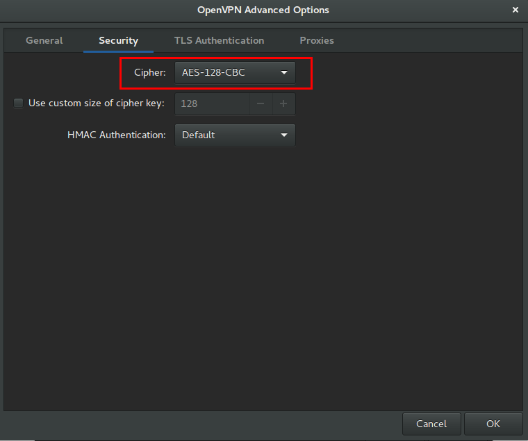

## Entering the configuration mode
```
vyos@cstack-fw1:~$ configure
```

## Configuration - basic network
```
set interfaces ethernet eth0 address '10.40.205.2/24'
set interfaces ethernet eth0 description 'OUTSIDE'
set interfaces ethernet eth4 address '172.16.0.1/16'
set interfaces ethernet eth4 description 'INSIDE-172.16.0.0'
set system gateway-address '10.40.205.1'
set system name-server '8.8.8.8'
set system host-name 'cstack-fw1'
```

### Configuration - accounts
#### Changing the password of the vyos account
> **Tested on VyOS 1.1.7**
> When you set a password of the vyos account, it automatically set the MD5 hashed password on it.

> *It is not safe these days, so you should change it once again.*


```
set system login user vyos authentication plaintext-password "<NEW PASSWORD>"
```

#### Creating an account who has admin privileges
You can add extra accounts via **set system login user** command

>Our account naming policy, we should use last_name.first_name format. but VyOS CLI does not support this format.
>That's why I used the last name only.

```
set system login user daehyung full-name "Daehyung Lee"
set system login user daehyung authentication public-keys "daehyung@daehyung-desktop"
set system login user daehyung authentication public-keys "daehyung@daehyung-desktop" type ssh-rsa 
set system login user daehyung authentication public-keys "daehyung@daehyung-desktop" key "AAAAB3N<SNIPPED>KVEtMAL44KkZR98qaMxwqJQ=="
set system login user daehyung level admin
```

## Configuration - Banner
```
set system login banner pre-login "\n* * * * * * * * * W A R N I N G * * * * * * * * * * *\nThis system is restricted to authorized users for\nauthorized use only. Unauthorized access is strictly\nprohibited and may be punishable under the Computer\nFraud and Abuse Act of 1984 or other applicable laws.\nAll persons are hereby notified that the use of this\nsystem constitutes consent to monitoring and auditing.\n* * * * * * * * * * * * * * * * * * * * * * * * * * *\n\n"
```

## Configuration - SSH
> I set SSHD not to use password authentication. so you should create any other account which has admin privileges.

>Otherwise, you can not access VyOS system with SSH service.

```
set service ssh port '2113'
set service ssh ciphers aes128-ctr,aes192-ctr,aes256-ctr
set service ssh mac hmac-sha1,hmac-ripemd160
set service ssh disable-password-authentication
```

## Configuration - NAT
### Source NAT
```
set nat source rule 100 outbound-interface 'eth0'
set nat source rule 100 source address '172.16.0.0/16'
set nat source rule 100 translation address 'masquerade'
```

### 1 to 1 NAT
Currently, we set 1 to 1 NAT for accessing CloudStack management Web Interface from the Office.
```
set interfaces ethernet eth0 address '10.40.205.11/24'

set nat destination rule 2000 description '1-to-1 NAT CloudStack Management SVR'
set nat destination rule 2000 destination address '10.40.205.11'
set nat destination rule 2000 inbound-interface 'eth0'
set nat destination rule 2000 translation address '172.16.1.11'

set nat source rule 2000 description '1-to-1 NAT CloudStack Management SVR'
set nat source rule 2000 outbound-interface 'eth0'
set nat source rule 2000 source address '172.16.1.11'
set nat source rule 2000 translation address '10.40.205.11'
```

## Configuration - DNS Forwarder
```
set service dns forwarding cache-size '0'
set service dns forwarding listen-on 'eth4'
set service dns forwarding name-server '8.8.8.8'
set service dns forwarding name-server '8.8.4.4'
```

## Configuration - OpenVPN
### TLS certificate for OpenVPN
[Read](generate_tls_certificate)
**Aware of using this**
> I set the encryption on vtun10 OpenVPN interface. You should check your cipher setting of the client before trying to connect.


```
set interfaces openvpn vtun10 local-port '1194'
set interfaces openvpn vtun10 mode 'server'
set interfaces openvpn vtun10 'persistent-tunnel'
set interfaces openvpn vtun10 protocol 'udp'
set interfaces openvpn vtun10 encryption aes128
set interfaces openvpn vtun10 server push-route '172.16.0.0/16'
set interfaces openvpn vtun10 server subnet '192.168.254.0/24'
set interfaces openvpn vtun10 tls ca-cert-file '/config/auth/openvpn/easy-rsa/keys/ca.crt'
set interfaces openvpn vtun10 tls cert-file '/config/auth/openvpn/easy-rsa/keys/cstack-fw1.crt'
set interfaces openvpn vtun10 tls dh-file '/config/auth/openvpn/easy-rsa/keys/dh2048.pem'
set interfaces openvpn vtun10 tls key-file '/config/auth/openvpn/easy-rsa/keys/cstack-fw1.key'
set interfaces openvpn vtun10 openvpn-option 'duplicate-cn'
set protocols static interface-route 192.168.254.0/24 next-hop-interface 'vtun10'
```

> duplicate-cn makes openvpn to allow multiple clients with the same common name to concurrently connect.

#### User/password authentication for OpenVPN client mode
> Note that this feature implemented >= 1.1.8.
> Need to test
A number of VPN providers (and some corporate VPNs) require that you use user/password authentication and do not support x.509-only authentication. Now this is supported by VyOS:
```
set interfaces openvpn vtun20 authentication username jrandomhacker
set interfaces openvpn vtun20 authentication password qwerty
set interfaces openvpn vtun20 tls ca-cert-file '/config/auth/openvpn/easy-rsa/keys/ca.crt'
set interfaces openvpn vtun20 mode client
set interfaces openvpn vtun20 remote-host 192.0.2.1
```

## Configuration - Firewall
**WORK IN PROGRESS**
```
set firewall name OUTSIDE-IN default-action 'drop'
set firewall name OUTSIDE-IN rule 10 action 'accept'
set firewall name OUTSIDE-IN rule 10 state established 'enable'
set firewall name OUTSIDE-IN rule 10 state related 'enable'
set firewall name OUTSIDE-LOCAL default-action 'drop'
 
set firewall name OUTSIDE-LOCAL rule 10 action 'accept'
set firewall name OUTSIDE-LOCAL rule 10 state established 'enable'
set firewall name OUTSIDE-LOCAL rule 10 state related 'enable'
set firewall name OUTSIDE-LOCAL rule 20 action 'accept'
set firewall name OUTSIDE-LOCAL rule 20 icmp type-name 'echo-request'
set firewall name OUTSIDE-LOCAL rule 20 protocol 'icmp'
set firewall name OUTSIDE-LOCAL rule 20 state new 'enable'
set firewall name OUTSIDE-LOCAL rule 30 action 'drop'
set firewall name OUTSIDE-LOCAL rule 30 destination port '2113'
set firewall name OUTSIDE-LOCAL rule 30 protocol 'tcp'
set firewall name OUTSIDE-LOCAL rule 30 recent count '4'
set firewall name OUTSIDE-LOCAL rule 30 recent time '60'
set firewall name OUTSIDE-LOCAL rule 30 state new 'enable'
set firewall name OUTSIDE-LOCAL rule 31 action 'accept'
set firewall name OUTSIDE-LOCAL rule 31 destination port '2113'
set firewall name OUTSIDE-LOCAL rule 31 protocol 'tcp'
set firewall name OUTSIDE-LOCAL rule 31 state new 'enable'
set firewall name OUTSIDE-LOCAL rule 32 action 'accept'
set firewall name OUTSIDE-LOCAL rule 32 destination port '1194'
set firewall name OUTSIDE-LOCAL rule 32 protocol 'udp'
set firewall name OUTSIDE-LOCAL rule 32 state new 'enable'

set interfaces ethernet eth0 firewall in name 'OUTSIDE-IN'
set interfaces ethernet eth0 firewall local name 'OUTSIDE-LOCAL'
```

The above rules will be being changed as below when you commit.
```
root@cstack-fw1:~# iptables -L -n
Chain INPUT (policy ACCEPT)
target     prot opt source               destination         
VYATTA_PRE_FW_IN_HOOK  all  --  0.0.0.0/0            0.0.0.0/0           
VYATTA_FW_LOCAL_HOOK  all  --  0.0.0.0/0            0.0.0.0/0           
VYATTA_POST_FW_IN_HOOK  all  --  0.0.0.0/0            0.0.0.0/0           


Chain FORWARD (policy ACCEPT)
target     prot opt source               destination         
VYATTA_PRE_FW_FWD_HOOK  all  --  0.0.0.0/0            0.0.0.0/0           
VYATTA_FW_IN_HOOK  all  --  0.0.0.0/0            0.0.0.0/0           
VYATTA_FW_OUT_HOOK  all  --  0.0.0.0/0            0.0.0.0/0           
VYATTA_POST_FW_FWD_HOOK  all  --  0.0.0.0/0            0.0.0.0/0           


Chain OUTPUT (policy ACCEPT)
target     prot opt source               destination         
VYATTA_PRE_FW_OUT_HOOK  all  --  0.0.0.0/0            0.0.0.0/0           
VYATTA_POST_FW_OUT_HOOK  all  --  0.0.0.0/0            0.0.0.0/0           


Chain OUTSIDE-IN (1 references)
target     prot opt source               destination         
RETURN     all  --  0.0.0.0/0            0.0.0.0/0            /* OUTSIDE-IN-10 */ state RELATED,ESTABLISHED
DROP       all  --  0.0.0.0/0            0.0.0.0/0            /* OUTSIDE-IN-10000 default-action drop */


Chain OUTSIDE-LOCAL (1 references)
target     prot opt source               destination         
RETURN     all  --  0.0.0.0/0            0.0.0.0/0            /* OUTSIDE-LOCAL-10 */ state RELATED,ESTABLISHED
RETURN     icmp --  0.0.0.0/0            0.0.0.0/0            /* OUTSIDE-LOCAL-20 */ state NEW icmptype 8
DROP       tcp  --  0.0.0.0/0            0.0.0.0/0            /* OUTSIDE-LOCAL-30 */ state NEW tcp dpt:2113 recent: UPDATE seconds: 60 hit_count: 4 name: DEFAULT side: source
           tcp  --  0.0.0.0/0            0.0.0.0/0            /* OUTSIDE-LOCAL-30 */ state NEW tcp dpt:2113 recent: SET name: DEFAULT side: source


RETURN     tcp  --  0.0.0.0/0            0.0.0.0/0            /* OUTSIDE-LOCAL-31 */ state NEW tcp dpt:2113
DROP       all  --  0.0.0.0/0            0.0.0.0/0            /* OUTSIDE-LOCAL-10000 default-action drop */


Chain VYATTA_FW_IN_HOOK (1 references)
target     prot opt source               destination         
OUTSIDE-IN  all  --  0.0.0.0/0            0.0.0.0/0           


Chain VYATTA_FW_LOCAL_HOOK (1 references)
target     prot opt source               destination         
OUTSIDE-LOCAL  all  --  0.0.0.0/0            0.0.0.0/0           


Chain VYATTA_FW_OUT_HOOK (1 references)
target     prot opt source               destination         


Chain VYATTA_POST_FW_FWD_HOOK (1 references)
target     prot opt source               destination         
ACCEPT     all  --  0.0.0.0/0            0.0.0.0/0           


Chain VYATTA_POST_FW_IN_HOOK (1 references)
target     prot opt source               destination         
ACCEPT     all  --  0.0.0.0/0            0.0.0.0/0           


Chain VYATTA_POST_FW_OUT_HOOK (1 references)
target     prot opt source               destination         
ACCEPT     all  --  0.0.0.0/0            0.0.0.0/0           


Chain VYATTA_PRE_FW_FWD_HOOK (1 references)
target     prot opt source               destination         
RETURN     all  --  0.0.0.0/0            0.0.0.0/0           


Chain VYATTA_PRE_FW_IN_HOOK (1 references)
target     prot opt source               destination         
RETURN     all  --  0.0.0.0/0            0.0.0.0/0           


Chain VYATTA_PRE_FW_OUT_HOOK (1 references)
target     prot opt source               destination         
RETURN     all  --  0.0.0.0/0            0.0.0.0/0           
```
